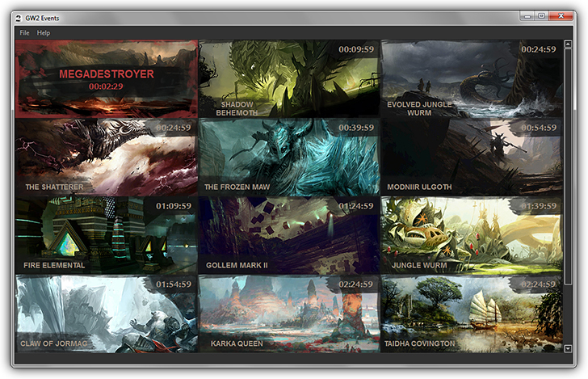

# GW2 Events



    
Guild Wars 2 Events is a "World Boss" timer for your desktop. It strives to maintain the GW2 style while providing
an easy to use timer interface.

You can find a working 64x build here: >Link goes here<


### To Build the Project:

This project will require Python 3 and optionally virtualenv==1.11 and virtualenvwrapper-win==1.1.5


* Create a new virtualenv folder:

```
mkvirtualenv <project_name>
```

* Activate it:

```
workon <project_name>
```

* Clone the GW2Events repository:

```
git clone https://github.com/igl00/gw2events.git
```

* Install the requirements:

```
pip install -r requirements.txt
```

**Note**: pywin32==219 may need to be downloaded manually: [PyWin32](http://sourceforge.net/projects/pywin32/files/pywin32/)

**Note**: pyinstaller==3.0dev may need to be downloaded manually: [PyInstaller](https://github.com/pyinstaller/pyinstaller/tree/python3)

### To Compile the project:

* Run PyInstaller(is should be in your system path):
```
pyinstaller gw2events.spec
```


## Software used

* [PySide](http://qt-project.org/wiki/PySide)
* [PyInstaller](https://github.com/pyinstaller/pyinstaller/wiki)
* [PsUtil](https://pypi.python.org/pypi/psutil)